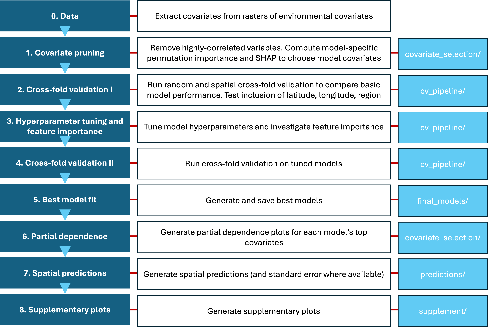

# Seagrass carbon mapping

Predict seagrass carbon density from remote sensing and environmental data (gap-filling within the study region). The workflow covers exploration (CV, variable selection), model choice (GPR, GAM, XGB with hyperparameter tuning), importance (permutation and SHAP), prediction (maps, uncertainty where possible, partial dependence), and supplement figures.

**Core question**: Estimate species-specific carbon stocks of seagrass beds from environmental and remote-sensing covariates. The models are validated for gap-filling near training data. 'Near' is by default set as at least 5km from the training core data to represent local (e.g. further up the coast) but be removed from at least some of the training environmental covariates.

---

## Quick start

From the project root:

```r
# Full paper pipeline (all figures and outputs)
source("modelling/run_paper.R")
```

Everything goes under `**output/**`: cache, covariate selection, CV/tuning results, final models, prediction maps, and supplement. Caches (spatial folds, prediction grids) live in `**output/cache/**` so heavy steps can be skipped on re-runs.

### Region exclusion

To exclude regions (e.g. Black Sea) from modelling and predictions, set in `run_paper.R` (around line 38):

```r
exclude_regions <- c("Black Sea")   # exclude Black Sea
exclude_regions <- character(0)     # include all regions
```

This applies to covariate pruning, CV, tuning, final fits, and prediction maps.

---

## Pipeline order (run_paper.R)


| Step   | What it does                                                                                       | Outputs                                                      |
| ------ | -------------------------------------------------------------------------------------------------- | ------------------------------------------------------------ |
| **-1** | Config (exclude_regions, model_list, pruning flags, n_folds, cv_type, etc.) and create output dirs | —                                                            |
| **0**  | Build `data/all_extracted_new.rds` from raw rasters if missing                                     | `data/all_extracted_new.rds`                                 |
| **1**  | Covariate pruning: correlation filter + per-model permutation (and optionally SHAP) importance     | `output/covariate_selection/` (pruned CSVs, importance CSVs) |
| **2**  | CV pipeline: spatial (or random) folds, run GPR/GAM/XGB, compare block sizes                       | `output/cv_pipeline/` (CV results, plots)             |
| **2b** | Spatial/categorical effect: env-only vs +lat vs +lon vs +region for each model                     | `output/cv_pipeline/`                                 |
| **3**  | Hyperparameter tuning for GPR, GAM, XGB (best config per model)                                    | `output/cv_pipeline/best_config_*.rds`                |
| **3b** | Permutation importance with tuned models and best vars                                             | `output/cv_pipeline/importance_perm_*.csv/.png`       |
| **3c** | SHAP importance with tuned models and best vars                                                    | `output/cv_pipeline/importance_shap_*.csv/.png`       |
| **4**  | CV and importance plots (second pass of cv_pipeline)                                               | `output/cv_pipeline/`                                 |
| **5**  | Fit and save final models on all data (XGB, GAM, GPR)                                              | `output/final_models/*_final.rds`                            |
| **6**  | Partial dependence plots for each final model                                                      | `output/covariate_selection/pdp_*.png`                       |
| **7**  | Spatial prediction maps (mean + SE for GPR) for each model                                         | `output/predictions/*_prediction_map.png`, `gpr_se_map.png`  |
| **8**  | Supplement: region outlines, target histograms, correlation, similarity                            | `output/supplement/`                                         |


---

## Directory structure

```
seagrass/
├── data/                         # Input data and build artefacts
│   ├── all_extracted_new.rds     # Main extracted dataset (built by pipeline step 0)
│   ├── env_rasters/              # NetCDF rasters (download from Zenodo repository: see below)
│   ├── ICES_ecoregions/          # Shapefiles from which to assign new points without regions (download online: see below)
│   └── MEOW/                     # MEOW shapefile for region assignment (download online: see below)
├── modelling/
│   ├── run_paper.R       # Main driver – run this for the full pipeline
│   ├── pipeline/                 # Data build, pruning, CV, tuning, importance, final fits
│   ├── plots/                    # Figures: PDPs, prediction maps, supplement
│   ├── R/                        # Shared R helpers, ML, raster extraction, plot config
├── output/                       # All pipeline outputs (replaces old figures/)
│   ├── cache/                    # Cached spatial folds and prediction grids
│   ├── covariate_selection/      # Pruning results, importance, PDPs
│   ├── cv_pipeline/       # CV results, tuning configs, importance plots
│   ├── final_models/             # XGB_final.rds, GAM_final.rds, GPR_final.rds
│   ├── predictions/             # Prediction maps, GPR SE map
│   └── supplement/               # Region shapes, histograms, correlation, similarity
└── README.md
```

See `**modelling/pipeline/README.md**`, `**modelling/plots/README.md**`, and `**modelling/R/README.md**` for a file-by-file description of each directory.

---

## Data flow

This is a short overview: see the README files in the relevant directories for more information.



---

## Caching

The pipeline reuses caches where possible. All cache files live under `**output/cache/**` (spatial fold `.rds` files and prediction grid caches). Delete the relevant file to force recomputation of:

- `**data/all_extracted_new.rds**` – rebuild extracted data (step 0).
- `**output/cache/*_folds.rds**` – recompute spatial (or random) folds for CV/tuning/importance.
- `**output/cache/prediction_grid_cache_*.rds**` – rebuild prediction grid used in supplement and spatial prediction maps.
- `**output/cv_pipeline/best_config_*.rds**` – re-run hyperparameter tuning (step 3).

---

## Models and methods

- **Models**: GAM, GPR (GauPro), XGBoost. All use the same per-model covariate set from pruning (permutation or SHAP). Where necessary, categorical variables (e.g. seagrass species, region) are encoded as integers.
- **CV**: Spatial block CV (with configurable block size(s)) or random split; `**n_folds`** and `**cv_type`** are set in `**run_paper.R`**.
- **Variable selection**: Correlation filter plus per-model permutation importance (and optionally SHAP); top vars per model are written to `**pruned_model_variables_perm.csv`** / `**pruned_model_variables_shap.csv`**.

## Environmental data

The raster files containing environmental covariates (from remote sensing and re-analysis products) are available at XXX (TODO: EITHER [ZENODO](https://zenodo.org/) OR [GITHUB LARGE FILE STORAGE](https://docs.github.com/en/repositories/working-with-files/managing-large-files/configuring-git-large-file-storage)). This file must be 

## Regions data

The following directories must be downloaded, unzipped (if necessary), and copied under the 'Data' repository into directories titled `ICES_ecoregions` and `MEOW` respectively.

### ICES Ecoregions

The International Council for the exploration of the Sea provides ecoregion shapefiles for the ocean around Europe. This data can be accessed at [this page](https://gis.ices.dk/geonetwork/srv/api/records/4745e824-a612-4a1f-bc56-b540772166eb) via [this link](https://gis.ices.dk/shapefiles/ICES_ecoregions.zip).

Persistent identifier: [https://gis.ices.dk/geonetwork/srv/metadata/4745e824-a612-4a1f-bc56-b540772166eb](https://gis.ices.dk/geonetwork/srv/metadata/4745e824-a612-4a1f-bc56-b540772166eb)

### MEOW Ecoregions

The Marine Ecoregions of the World (MEOW) document global ecoregions. These are available via UNEP[](https://data-gis.unep-wcmc.org/portal/home/item.html?id=80567b4443f4457b822f645a2f0d70cf) via [this link](https://data-gis.unep-wcmc.org/portal/home/item.html?id=80567b4443f4457b822f645a2f0d70cf#:~:text=Description-,Download%20Dataset,-This%20dataset%20combines).

Persistent identifier: [https://data-gis.unep-wcmc.org/server/rest/services/Hosted/WCMC036_MEOW_PPOW_2007_2012/FeatureServer](https://data-gis.unep-wcmc.org/server/rest/services/Hosted/WCMC036_MEOW_PPOW_2007_2012/FeatureServer)
