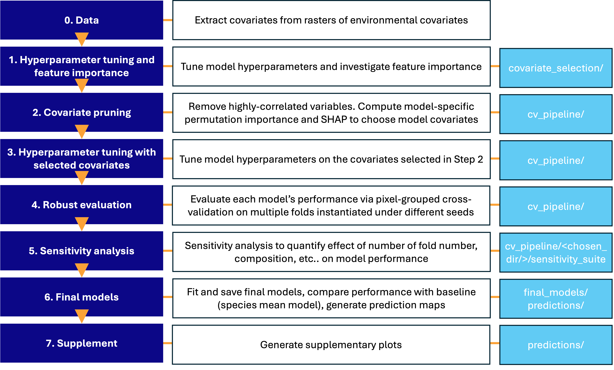

# Seagrass carbon mapping

This repository predicts carbon density of sediment cores on seagrass beds from remote sensing and environmental data. The workflow covers exploration (CV, variable selection); model choice – Generalised Additive Models (GAMs), Linear Regressors (LRs), Gaussian Process Regressors (GPRs), and XGBoost regressors (XGB) – with hyperparameter tuning; SHAP feature importance, prediction (maps, uncertainty, partial dependence), and supplement figures to accompany the paper, *Oceanographic drivers of carbon storage in European seagrass beds*, Gallo and Timmerman et al. (2026).

---

## Quick start

From the project root:

```r
# 0) Instantiate environment (required)
renv::restore(prompt = FALSE)

# 1) Optional (expensive): robust tuning seed sweep
source("modelling/analysis/tuning_seed_sweep.R")

# 2) Main robust multiseed pipeline (recommended publication workflow)
source("modelling/run_multiseed_pixel_grouped.R")
```

Generated files are stored in  `output/` in a timestamped subfolder e.g. `output/pixel_grouped_<timestamp>`. These include covariate selection, robust tuning/evaluation, final models, prediction maps, diagnostics, and supplement folders. Cached files shared between runs with different `pipeline_config.R` files e.g. prediction grids go in `output/cache/`.

---

## Config (`pipeline_config.R`)

Pipeline settings are centralized in `modelling/pipeline_config.R` (`get_pipeline_config()`), then consumed by `modelling/run_multiseed_pixel_grouped.R`and subsidiary scripts.

### Plotting / reporting

- `dpi` – Output figure resolution.
- `show_titles` – If `TRUE`, include plot titles/subtitles (useful for interactive runs); set `FALSE` for paper-ready figure panels.

### Pipeline toggles

- `do_shap_refined_tuning` – re-tune hyperparameters after robust SHAP pruning.
- `do_sensitivity` – run sensitivity suite and associated plots.
- `do_diagnostics` – run train/test fraction and variance diagnostics.
- `do_fit_final_models`, `do_supplement` – final model fitting and additional supplementary figures.
- `multiseed_run_output_id` – suffix for this driver run’s evaluation folder under `cv_pipeline/multiseed_runs/`; default `NULL` uses a timestamp so repeated runs do not overwrite each other.
- `use_robust_seeds_from_tuning_sweep` – if `TRUE`, load `robust_fold_seed_list` (and `eval_fold_seed_list` if stored) from `output/<cv_regime>/cv_pipeline/tuning_seed_sweep_runs/chosen_seeds_latest.rds` after running `modelling/analysis/tuning_seed_sweep.R`. This is helpful since `tuning_seed_sweep.R` is very compute and time-intensive.

### Target and transforms

- `target_var` – Response column in `data/all_extracted_new.rds` (default `median_carbon_density_100cm`).
- `log_transform_target` – If `TRUE`, models are fit on `log(y)`while predictions are back-transformed for reporting and metrics.

### Spatial filtering

- `exclude_regions` – Region names to remove from all modelling stages. Use `character(0)` to include all regions:

```r
exclude_regions <- c("Black Sea")   # exclude Black Sea
exclude_regions <- character(0)     # include all regions
```

This applies to covariate pruning, CV, tuning, final fits, and prediction maps.

### Covariate pruning / selection

- `use_correlation_filter` – If `TRUE`, drops highly correlated covariates (default `r > 0.8`) before model-specific selection.
- `correlation_filter_threshold` – Absolute correlation threshold for pruning (default `r > 0.8`).
- `permutation_max_vars` – Maximum number of covariates retained after permutation selection (default `15`).
- `n_permutations` – Replicates per variable when computing permutation importance (default `1` since very computationally intensive).
- `permutation_coverage` – Cumulative importance coverage target (default `0.99`).
- `use_shap_per_model` – Prefer per-model SHAP-selected covariate sets where available (default `TRUE`).

### Models

- `model_list` – models to run (default `c("GPR", "GAM", "XGB", "LR")`).

### Cross-validation design

- `n_folds` – Number of CV folds (default `5L` as chosen by sensitivity investigation).
- `cv_type` – One of `"random"`, `"location_grouped"`, `"pixel_grouped"`, or `"spatial"` (block CV).
  - Use `"spatial"` to test extrapolation to new geography away from sampled cores. `"pixel_grouped"` is the grouping reported in the paper.  It avoids leakage between train and test sets from coarse raster pixels.
- `cv_blocksize` – Spatial block size (metres) for single-block steps. Only relevant when `cv_type` is `"spatial".`
- `cv_blocksize_scan` – Vector of block sizes (metres) for CV comparison scans. Only relevant when `cv_type` is `"spatial".`

---

## Pipeline order (`run_multiseed_pixel_grouped.R`)





| Step    | What it does                                                   | Outputs                                                                           |
| ------- | -------------------------------------------------------------- | --------------------------------------------------------------------------------- |
| `-1`    | Load config and create directories                             | `output/<cv_regime>/`, `output/cache/`, generaterun metadata                      |
| `0`     | Build `data/all_extracted_new.rds` if missing                  | `data/all_extracted_new.rds`                                                      |
| `3`     | Robust multiseed hyperparameter tuning                         | `cv_pipeline/robust_pixel_grouped_tuning_robustSeeds`_*                           |
| `4`     | Robust SHAP covariate pruning + SHAP plots                     | `output/<cv_regime>/covariate_selection/robust_pixel_grouped/`                    |
| `5`     | Optional robust re-tuning with SHAP-selected covariates        | updated robust configs                                                            |
| `6`     | Robust held-out evaluation on disjoint eval seeds              | `cv_pipeline/multiseed_runs/<evaluation_stem>_<run_id>/` (timestamped by default) |
| `7`     | Sensitivity analyses and plots (optional)                      | `.../multiseed_runs/.../sensitivity_suite/` (same run folder)                     |
| `8`     | Train/test fraction and target-variance diagnostics (optional) | diagnostics CSV/plots                                                             |
| `9`     | Fit final models from robust configs and robust covariates     | `output/<cv_regime>/final_models/`                                                |
| `10`    | Benchmark testing against species-mean baseline                | `output/<cv_regime>/analysis/`                                                    |
| `11-13` | Spatial maps, partial dependence, supplement                   | `predictions/`, `covariate_selection/`, `output/supplement/`                      |


---

## Directory structure

```text
seagrass_mapping/
├── data/                         # Input data and build artefacts
│   ├── all_extracted_new.rds     # Main extracted dataset (built by pipeline step 0)
│   ├── covariate_rasters/              # NetCDF rasters (download from Zenodo repository: see below)
│   ├── ICES_ecoregions/          # Shapefiles from which to assign new points without regions (download online: see below)
│   └── MEOW/                     # MEOW shapefile for region assignment (download online: see below)
├── modelling/
│   ├── run_multiseed_pixel_grouped.R  # Main driver for publication workflow
│   ├── config/                   # Central pipeline config
│   ├── multiseed/                # Robust multiseed tuning/pruning/eval
│   ├── analysis/                 # Model comparison, sensitivity, diagnostics
│   ├── pipeline/                 # Data build, pruning, CV, tuning, importance, final fits
│   ├── plots/                    # Figures: PDPs, prediction maps, supplement
│   ├── R/                        # Shared R helpers, ML, raster extraction, plot config
├── output/                       # All pipeline outputs (replaces old figures/)
│   ├── cache/                    # Shared cached spatial folds and prediction grids
│   ├── <cv_regime>/<timestamp>   # Regime-specific outputs (based on `cv_type`)
│   │   ├── covariate_selection/  # Pruning results, importance, PDPs
│   │   ├── cv_pipeline/          # Tuning configs, multiseed_runs/, tuning_seed_sweep_runs/
│   │   ├── final_models/         # XGB_final.rds, GAM_final.rds, GPR_final.rds
│   │   ├── predictions/          # Prediction maps (+ SE where available)
│   └── supplement/               # Shared supplement outputs
├── report/                       # Figures for report and repository
└── README.md
```

`<cv_regime>` is controlled by `cv_regime_name` in `modelling/pipeline_config.R`:

- `"pixel_grouped"` -> `output/pixel_grouped` (default)
- `"random"` -> `output/random` (naïve random split)
- `"location_grouped"` -> `output/location_grouped` (group by unique latitude/longitude pairs)
- `"spatial"` -> `output/spatial_<cv_blocksize>m` (group by spatial block. Not recommended due to existing spatial clustering and small dataset)

See `modelling/pipeline/README.md`, `modelling/plots/README.md`, `modelling/multiseed/README.md`, and `modelling/R/README.md` for per-directory details.

---

## Data flow

This is a short overview: see the README files in the relevant directories for more information.

- `pipeline_config.R` defines defaults and seed policy.
- `run_multiseed_pixel_grouped.R` orchestrates build -> robust selection -> robust evaluation -> final outputs.
- Effective run settings are written to `output/<cv_regime>/run_metadata/pipeline_config_effective.rds`.
- Final fitted models are saved to `output/<cv_regime>/final_models/` and reused by map/PDP scripts.

---

## Caching

The pipeline reuses caches where possible. All cache files live under `output/cache/` (spatial fold `.rds` files and prediction grid caches). Delete the relevant file to force recomputation of:

- `data/all_extracted_new.rds` – rebuild extracted data (step 0).
- `output/cache/*_folds.rds` – recompute spatial (or random) folds for CV/tuning/importance.
- `output/cache/prediction_grid_cache_*.rds` – rebuild prediction grids.
- `output/<cv_regime>/cv_pipeline/best_config_*.rds` – re-run hyperparameter tuning.

---

## Models and methods

- **Models** – GAM, GPR, XGBoost. All use the same per-model covariate set from pruning (permutation or SHAP). Where necessary, categorical variables (e.g. seagrass species, region) are encoded as integers.
- **CV** – pixel-grouped multiseed CV is the default publication workflow; core controls are in `pipeline_config.R`.
- **Variable selection** – Correlation filter plus per-model permutation importance (and optionally SHAP); top vars per model are written to `pruned_model_variables_perm.csv` / `pruned_model_variables_shap.csv`.

## Cross-Validation Approaches

The pipeline evaluates predictive performance under multiple fold construction strategies (see `modelling/pipeline/cv_pipeline.R`). This matters because the data are spatially clustered and some observations share identical `(longitude, latitude)` raster-derived covariates.

- `random_split` – Naive split across rows; train/test may contain points from the same location (and duplicate covariates can leak), so results are a highly optimistic baseline for out-of-sample prediction.
- `location_grouped_random` – All rows that share the exact same `(longitude, latitude)` are assigned to the same fold; this prevents leakage from duplicate coordinates but not from distinct locations that fall in the same coarse raster pixel.
- `pixel_grouped_random` – All rows with identical raster-derived covariate vectors are assigned to the same fold. This is strictly more conservative than `location_grouped_random`: distinct locations that map to the same raster pixel (common at ~4 km resolution) are also grouped, so the model is never evaluated on inputs it has seen verbatim during training. Used as the primary fold strategy for hyperparameter tuning, covariate pruning, and importance estimation.
- `spatial_block_<m>m` – The study area is partitioned into spatial blocks of size `<m>` metres; folds hold out whole blocks, testing extrapolation to new geography away from sampled cores and indicating how well covariates capture spatial structure at that scale.
- `region_stratified_<m>m` – Spatial blocks are built within each ecoregion `region`, and then folds are combined so each fold retains representation from multiple regions; this reduces “leave-one-region-out” artifacts caused by how blocks fall across coastal regions.

All fold types are cached/reused via `output/cache/` to speed up re-runs.

---

## Reproduce results

1. Place required inputs under `data/` (`all_extracted_new.rds` can be built by step 0, rasters and region shapefiles must be downloaded as described below).
2. Run from the repository root:
  - `Rscript -e "renv::restore(prompt = FALSE)"`
  - optional: `Rscript modelling/analysis/tuning_seed_sweep.R`
  - `Rscript modelling/run_multiseed_pixel_grouped.R`
3. Record and archive:
  - `output/<cv_regime>/run_metadata/pipeline_config_effective.rds`
  - the timestamped folder under `output/<cv_regime>/cv_pipeline/multiseed_runs/` for that run (evaluation CSVs, `sensitivity_suite/` if run).
4. Once models have been saved and predictions generated, the `prediction_maps.ipynb` Jupyter notebook can be used to generate the predictive maps of carbon stocks. This requires downloading extra datasets (see below).
Seed policy is documented in `modelling/SEED_REGISTRY.md`.

## Environmental data

The NetCDF raster files containing environmental covariates (from remote sensing and re-analysis products) are not stored in this repository. Download them from the data archive associated with the paper (e.g. the Zenodo record referenced in the manuscript) and place all `.nc` files under `data/covariate_rasters/`. The pipeline will auto-discover these covariates at runtime using `raster_covariates` from `modelling/R/extract_covariates_from_rasters.R`.

## Regions data

The following directories must be downloaded, unzipped (if necessary), and copied under the 'data' repository into directories titled `ICES_ecoregions` and `MEOW` respectively.

### ICES Ecoregions

The International Council for the exploration of the Sea provides ecoregion shapefiles for the ocean around Europe. This data can be accessed at [this page](https://gis.ices.dk/geonetwork/srv/api/records/4745e824-a612-4a1f-bc56-b540772166eb) via [this link](https://gis.ices.dk/shapefiles/ICES_ecoregions.zip).

Persistent identifier: [https://gis.ices.dk/geonetwork/srv/metadata/4745e824-a612-4a1f-bc56-b540772166eb](https://gis.ices.dk/geonetwork/srv/metadata/4745e824-a612-4a1f-bc56-b540772166eb)

### MEOW Ecoregions

The Marine Ecoregions of the World (MEOW) document global ecoregions. These are available via UNEP via [this link](https://data-gis.unep-wcmc.org/portal/home/item.html?id=80567b4443f4457b822f645a2f0d70cf#:~:text=Description-,Download%20Dataset,-This%20dataset%20combines).

Persistent identifier: [https://data-gis.unep-wcmc.org/server/rest/services/Hosted/WCMC036_MEOW_PPOW_2007_2012/FeatureServer](https://data-gis.unep-wcmc.org/server/rest/services/Hosted/WCMC036_MEOW_PPOW_2007_2012/FeatureServer)

## Prediction Map datasets

### Seagrass Essential Ocean Variable (EOV)

The seagrass cover Essential Ocean Variable (EOV) was obtained from the EMODnet product catalogue from the EMODnet Seabed Habitats project via [this link](https://doi.org/10.34892/x6r3-d211). This allowed the calculation of national carbon stocks in seagrass beds from model-predicted carbon density. The species '`eunis_id`' codes were used to map the reported species to the classes in the core data dataset (see Supplementary Seagrass Essential Ocean Variable (EOV)).

### Exclusive Economic Zones (EEZs)

Exclusive Economic Zones (EEZs) were obtained from the Marine Regions website via [this link](https://www.marineregions.org/downloads.php). We used the `World EEZ v12 (2023-10-25, 122MB)` file in GeoPackage format. EEZs were used to attribute seagrass bed carbon to national territories.

---

## Assumptions and limitations

- This workflow is designed for gap-filling near sampled conditions; extrapolation to novel environments may degrade (as shown when datasets `cv_type = "spatial`).
- Reported performance depends on fold construction and seed policy; robust multiseed evaluation is used to reduce split-variance artifacts.

